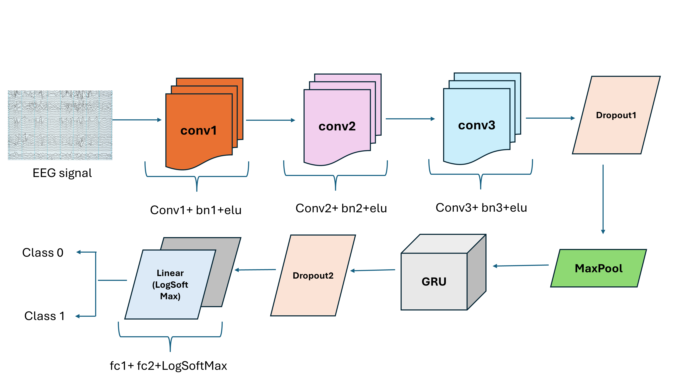
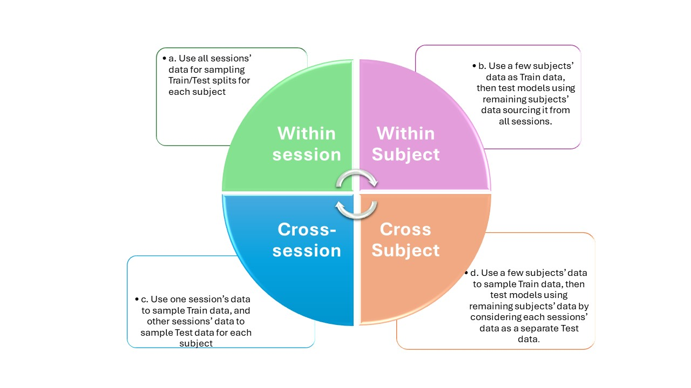

# Motor_Imagery_Classification_EEG_CNN-GRU
This repo describes an implementation of the models described in "Exploring BCI Literacy in Motor Imagery Task Classification Performance".
The repository consists of experiments and code files for Motor Imagery Classification on "A large EEG dataset for studying cross-session variability in motor imagery brain-computer interface".

In this, we have proposed a novel hybrid model EEG_CNN-GRU consisting of Convolutional Neural Networks (CNNs) and Gated Recurrent Units (GRU) to capture spatio-temporal patterns in the EEG data. The architecture of the proposed model is given below:

We have performed different cross-session and cross-subject experiments. The genral scenario of the experiments performed in the literature is described in the following figure. For this study, we have incorporated scenarios 'c' and 'd' only.

## Requirements
In order to run this code you need to install the following modules:

Numpy and Scipy (http://www.scipy.org/install.html)

Scikit-Learn (http://scikit-learn.org/stable/install.html)

Python 3.7
Pytroch 1.3.1
Cudatoolkit 10.1.243
Cudnn 7.6.3

## Cross-session and Cross-subject experiments
Each experiment has code, results and model folder.
Please note that only one experiment code, its results and some of the models only is provided.
The user can further change the path or add more files for the complete experimentation.
## Experiment 1
In this experiment, we aimed to understand how the model performs when trained on individual sessions and tested on the final session.
For each subject, we trained 4 models taking data from session 1, 2, 3, and 4 separately and tested their performance over fifth session.
For example, the model was trained on the first session and tested on the fifth, then trained on the second session and tested on the fifth session, and so on. The data for each session and each user was further divided into Train/Test into 60-40 split.
The results of experiment 1 is shown below:
[! Alt text](Experiment_1/results/individual_session_exp_1.png)

## Experiment 2
This experiment investigated the effect of gradually increasing the training data up to session 4, hence training a total of 4 models for each subject.
In this experiment also, Test data was sampled from session 5 only.
Initially, the model was trained on the first session alone. Then, training data was incrementally expanded to include the first two sessions, the first three sessions, and first four sessions as shown in the below figure:
[! Alt text](exp_2_design.png)

The combined training data from each step of merging was further divided in Train/Test split of 60:40 ratio and the training of CNN-GRU hybrid models was done by incorporating 5-fold cross-validation. The results of this experiment (cross-session) is shown in the following figure:
[! Alt text](Experiment2/results/multiple_session_exp_2.png)

## Experiment 3
The third experiment was performed to check the deployability of models from experiments 1 & 2 in cross-subject scenario, especially for the users who were found to be BCI literate i.e. the better performing models as compared to other participants.
Results of the cross-subject experiment is shown in the upcoming figure:
[! Alt text](Experiment_3/results/cross_subject_results.png)
  

